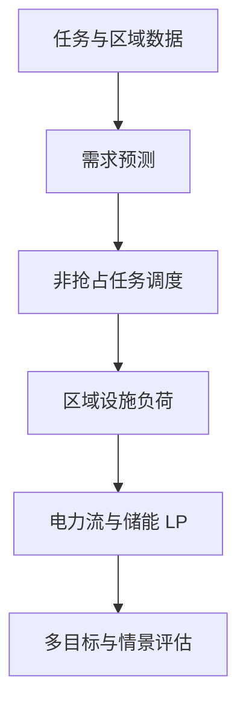

# 华数杯 C 题：面向算电协同的多目标调度优化

本仓库给出一个从原始 Excel 到预测、任务排程、电力/储能优化、图表和 PDF 报告的完整可复现解法。工作流遵循 [`sweetcornna/mathodology`](https://github.com/sweetcornna/mathodology) 的“题意锁定—多路线建模—证据化实现—独立审阅—提交打包”方法。

## 解法概览



- Q1：按“小时 × 区域 × 任务类型”预测 GPU·h 需求；用确定性候选插入与完整时间窗回退生成基础排程。
- Q2：在不重优化储能的条件下，比较基础排程与成本—碳联合排程，报告成本、购电碳排、绿电利用、峰值、等待和时延。
- Q3：固定题目给出的基准 AI 负荷，以六个区域稀疏线性规划优化购售电、充放电、SOC、峰值和爬坡，并与相同负荷的优化无储能方案匹配比较。
- Q4：在实时/分时/区域平价机制下分别重排任务，并对能源层施加碳排 ε 上限、可再生能源 ±20% 与日内波动情景，形成可解释的权衡表。

全部 50,000 条任务均按附件 1 的 GPU-hour 折算口径通过算力容量、IT 功率、网络时延、实时任务零等待和 2406 小时闭园检查。任务层采用可行启发式，不宣称联合整数模型全局最优；能源层为给定任务负荷下的 LP 最优解。

## 快速复现

建议使用 Python 3.11 或 3.12：

```bash
python -m venv .venv
source .venv/bin/activate
python -m pip install -r requirements.txt
python run_all.py --data-dir data --output-dir outputs --config config.json
python tools/generate_report.py
```

如需最佳中文 PDF 字体，可将合法取得的 `NotoSansSC-Regular.ttf` 放入 `assets/`；未提供时报告生成器会使用 ReportLab 内置中文字体。

快速自检：

```bash
python run_all.py --quick --data-dir data --output-dir outputs --config config.json
python -m pytest -q
```

## 仓库结构

```text
data/                    在本地放置六个题目 Excel 附件（不随公开仓库分发）
src/shumo_ccc/           数据、预测、调度、电力与储能模型
tests/                   核心守恒和边界测试
docs/model.md            数学模型、假设与算法说明
docs/reproducibility.md  环境、命令和结果溯源
outputs/tables/          Q1–Q4 核心结果与约束审计
outputs/figures/         SVG/PNG 结果图
paper/solution_report.*  中文报告（PDF 与 Markdown）
```

## 重要数据边界

- 指标已按附件 1 锁定：碳排为“总购电量 × 电网碳强度”；新能源利用率为“直供 + 新能源充电 + 外送”除以可用新能源，等价于 `1 - 弃电/可用新能源`。售出绿电不抵扣购电碳排。
- 六区域的 `AvailableRenewable_MW` 逐小时完全相同，导致区域绿电差异不可识别。
- 题目给定基准 SOC 在 RegionE 首时段有约 1 MWh 递推偏差，且 D/E/F 末端 SOC 低于初值；原基准仅作账面比较，不作为满足统一终端约束的可行解。
- 数据中富余可再生能源较多且允许售电，因而可能出现零购电碳排和负净成本；该结果只在给定数据和规则内成立。

## 本地生成的关键产物

- `paper/solution_report.pdf`：完整题解与结果报告
- `outputs/run_manifest.json`：一次全量运行的总验证门
- `outputs/tables/q1_constraint_validation.json`：全量任务硬约束审计
- `outputs/tables/q4_scenario_results.csv`：联合情景结果

公开仓库不提交赛事原始数据及其逐时派生图表/表格；运行上述命令可在本地完整重建。

## 许可与声明

代码按 MIT License 发布。题目附件不随公开仓库分发；请从赛事授权来源取得，并按上述文件名放入 `data/`。
